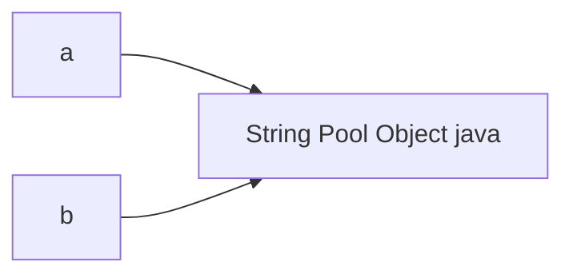
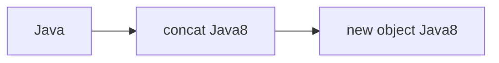
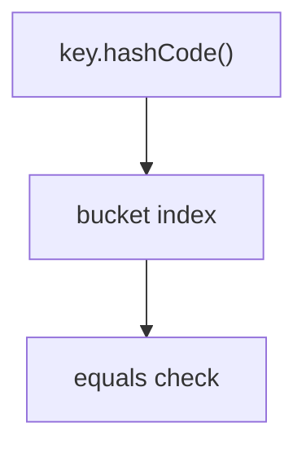

# Day 2 — String, `equals()`, `hashCode()`, Immutability Notes

# 1) String Fundamentals

## ✅ What is String in Java

* `String` is a **final class** in Java
* Represents an **immutable sequence of characters**
* One of the most frequently used Java types
* Used in:

  * APIs
  * request/response DTOs
  * logging
  * SQL queries
  * JSON/XML
  * HashMap keys
  * class loading

```java
String name = "Java";
```

## ✅ Why String is special

* immutable
* String Constant Pool support
* cached hashCode
* thread-safe by design
* secure for sensitive identifiers and class names
* JVM optimized

## 📝 Points to remember

* String literals go to **String Constant Pool (SCP)**
* `new String()` creates **heap object**
* String is **heavily optimized by JVM**

---

# 2) String Creation Ways

## ✅ Using literal

```java
String s1 = "Java";
```

* JVM checks SCP first
* reuses existing object if found
* memory efficient

## ✅ Using `new`

```java
String s2 = new String("Java");
```

* always creates **new heap object**
* also checks/creates pooled literal if absent

## Mermaid Diagram


## 🎯 Interview trap

```java
String s = new String("Java");
```

Possible objects created:

* 1 in SCP (if absent)
* 1 in heap

---

# 3) String Constant Pool (SCP)

## ✅ What is SCP

* special area inside heap
* stores only **unique literals**
* duplicate literals reuse same object
* saves memory

```java
String a = "java";
String b = "java";
```

## Memory Diagram



## 📝 Important

* `a == b` → `true`
* same pooled reference reused

## ✅ Benefits

* reduced memory
* faster comparisons
* better JVM optimization

---

# 4) Why String is Immutable

## ✅ Definition

Once created, String object content **cannot be changed**.

```java
String s = "Java";
s.concat("8");
System.out.println(s);
```

Output:

```java
Java
```

## ✅ Why JVM designers made it immutable

* security (class names, URLs, file paths)
* thread safety
* String pool reuse
* cached hashCode stability
* safe HashMap key

## Internal Flow



## 📝 Must remember

* modifying methods create **new String object**
* original remains unchanged

---

# 5) `==` vs `equals()`

## ✅ `==`

* compares **references**
* checks same object or not

## ✅ `equals()`

* compares **content**
* character-by-character logical equality

```java
String a = new String("java");
String b = new String("java");

System.out.println(a == b);      // false
System.out.println(a.equals(b)); // true
```

## 📌 Difference Table

| Topic          | `==`         | `equals()`        |
| -------------- | ------------ | ----------------- |
| compares       | reference    | content           |
| String usage   | mostly avoid | preferred         |
| custom classes | unsafe       | override required |

## 📝 Interview point

* For Strings, always prefer **`equals()` for logical comparison**

---

# 6) `equals()` and `hashCode()` Contract

## ✅ Golden rule

If two objects are equal using `equals()`, they **must return same `hashCode()`**.

## Example

```java
class User {
    int id;

    @Override
    public boolean equals(Object o) {
        return this.id == ((User) o).id;
    }

    @Override
    public int hashCode() {
        return Integer.hashCode(id);
    }
}
```

## Mermaid HashMap Flow



## 🎯 Why important

Used by:

* HashMap
* HashSet
* LinkedHashMap
* ConcurrentHashMap

## 📝 Must remember

* override both together
* overriding only `equals()` breaks collections

---

# 7) Why String is Perfect HashMap Key

## ✅ Reasons

* immutable
* cached hashCode
* stable bucket location
* safe for retrieval

```java
Map<String, String> map = new HashMap<>();
map.put("name", "kp");
```

## 📝 Interview answer line

> String is ideal as HashMap key because immutability guarantees its hashCode and bucket position never change.

---

# 8) `intern()` Method

## ✅ Purpose

Moves heap string reference to SCP equivalent.

```java
String s1 = new String("java");
String s2 = s1.intern();
```

## ✅ Use case

* deduplication
* memory optimization
* compare pooled references

---

# 9) StringBuilder vs StringBuffer

## ✅ Problem with String concatenation

```java
String s = "a";
s = s + "b";
```

Creates multiple objects.

---

## ✅ StringBuilder

* mutable
* fast
* not thread-safe
* preferred in single-threaded logic

```java
StringBuilder sb = new StringBuilder("Java");
sb.append(" 21");
```

---

## ✅ StringBuffer

* mutable
* synchronized
* thread-safe
* slower than StringBuilder

```java
StringBuffer sb = new StringBuffer("Java");
```

## 📌 Difference Table

| Topic       | String      | StringBuilder | StringBuffer |
| ----------- | ----------- | ------------- | ------------ |
| mutable     | no          | yes           | yes          |
| thread-safe | yes         | no            | yes          |
| performance | slow concat | fast          | medium       |

## 📝 Remember

* interview default answer → **StringBuilder preferred**

---

# 10) Custom Immutable Class Design

## ✅ Rules

* make class `final`
* private final fields
* initialize via constructor
* no setters
* defensive copy for mutable fields

```java
final class Employee {
    private final String name;

    Employee(String name) {
        this.name = name;
    }

    public String getName() {
        return name;
    }
}
```

## ✅ Benefits

* thread safety
* caching
* safe sharing
* predictable behavior

---

# 11) Common String Interview Coding Problems

## ✅ Must practice

* reverse string
* palindrome
* anagram
* duplicate characters
* first non-repeating char
* frequency map
* count vowels
* string rotation
* remove spaces
* word reverse

---

# 12) Most Important Trap Concepts

## ✅ Must remember bullets

* String is **final + immutable**
* literals reuse SCP object
* `new String()` creates heap object
* `==` checks reference
* `equals()` checks content
* String hashCode is cached
* StringBuilder faster than String concat
* StringBuffer synchronized
* immutable object safe as map key
* override `equals()` + `hashCode()` together

---


