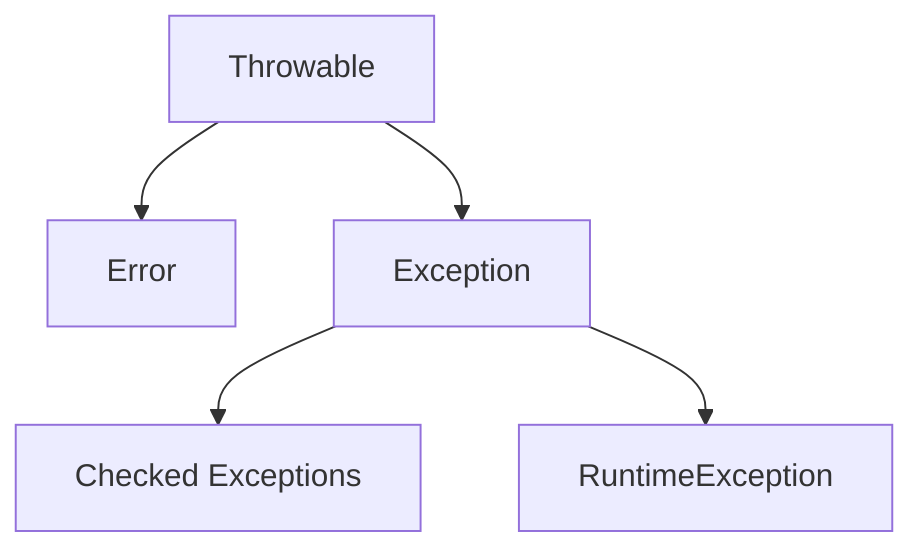

# 🔥 Basics of Exception Handling — INTERVIEW NOTES (IN-DEPTH)

---

## ✅ Definition

* Exception handling in Java is a mechanism to detect, propagate, and handle runtime abnormal conditions so that the application can continue gracefully or fail in a controlled way.
* It prevents sudden program termination due to unexpected issues like invalid input, null values, database failures, or file problems.

### 📌 Simple 1-Line Explanation

* Exception handling means managing runtime problems without crashing the application.

> 👉 **Interview Tip:**
> A strong answer should always mention graceful recovery + controlled failure + business continuity.

---

## 🧠 Why It Is Important

* Helps build robust and fault-tolerant applications
* Prevents abrupt JVM termination
* Improves user experience
* Helps maintain transaction integrity
* Makes systems debuggable and supportable
* Essential in banking domain systems where failures must be controlled

### 🏦 Banking Domain Relevance

* Fund transfer

  * If debit succeeds but credit fails, exception handling ensures rollback
* ATM withdrawal

  * Network timeout should not deduct balance twice
* Loan processing

  * Validation exceptions prevent invalid loan approvals
* Payment gateway

  * Retry logic handles temporary gateway downtime

> 🔥 **Important:**
> In production systems, exception handling is directly linked with:
>
> * data consistency
> * observability
> * retry strategy
> * customer trust

---

## 🔹 Core Concepts

### 1) What is an Exception?

* An exception is an event that disrupts normal program flow
* It occurs during runtime
* JVM creates an exception object
* That object contains:

  * exception type
  * message
  * stack trace
  * root cause

#### Example Causes

* divide by zero
* null reference
* invalid file path
* DB connection failure
* array index issue

### 2) Why Do We Need Exception Handling?

* To avoid application crashes
* To recover from recoverable failures
* To provide meaningful error messages
* To separate business logic from failure logic
* To log issues for debugging
* To ensure cleanup of resources

#### Internal Behavior

1. Problem occurs
2. JVM creates exception object
3. Stack unwinding starts
4. Matching catch block searched
5. If found → handled
6. Else → JVM default handler terminates thread

### 3) What Happens If Exception Is Not Handled?

* JVM propagates exception to caller method
* This is called exception propagation
* If no method handles it:

  * thread terminates
  * stack trace printed
  * program may stop

#### Banking Example

* During UPI payment:

  * DB timeout occurs
  * if not handled → transaction status remains inconsistent
  * user may see “payment failed” but amount deducted

> 🔥 **Important:**
> Unhandled exceptions in microservices can cause:
>
> * API 500 errors
> * retry storms
> * partial updates
> * dead letter queue growth

### 4) Difference Between Error and Exception

| Aspect   | Exception               | Error                         |
| -------- | ----------------------- | ----------------------------- |
| Meaning  | Recoverable issue       | Serious JVM/system issue      |
| Handling | Can be handled          | Usually should not be handled |
| Cause    | App logic/runtime issue | JVM/resource failure          |
| Example  | NullPointerException    | OutOfMemoryError              |
| Recovery | Usually possible        | Usually not safe              |

> 👉 **Interview Tip:**
> Say:
> “Exceptions are application-level recoverable conditions, while Errors represent serious JVM-level failures.”

### 5) Exception Hierarchy in Java

#### Plain text

```text
Throwable
├── Error
│   ├── OutOfMemoryError
│   └── StackOverflowError
└── Exception
    ├── IOException
    ├── SQLException
    └── RuntimeException
        ├── NullPointerException
        ├── ArithmeticException
        └── IllegalArgumentException
```




#### Key Understanding

* Throwable is root parent
* Exception → application issues
* Error → JVM/system failures
* RuntimeException → unchecked exceptions

### 6) What is Throwable?

* Throwable is the topmost superclass of all exceptions and errors
* Anything that can be thrown by JVM or application extends Throwable

#### Why It Exists

Common parent for:

* Exception
* Error

Enables:

* stack trace
* message
* cause chaining

#### Common Methods

```java
getMessage()
printStackTrace()
getCause()
```

### 7) Difference: Throwable vs Exception vs Error

| Type      | Meaning             | Use Case                      |
| --------- | ------------------- | ----------------------------- |
| Throwable | Root class          | Generic handling/logging      |
| Exception | Recoverable issues  | Business + technical failures |
| Error     | JVM critical issues | Usually not handled           |

> 👉 **Interview Trap:**
> Do not say:
> “Throwable means exception only”
> It includes both Exception and Error.

### 8) Where RuntimeException Fits?

* RuntimeException is child of Exception
* It represents unchecked exceptions
* Compiler does not force handling
* Mostly caused by:

  * programming bugs
  * invalid assumptions
  * bad input validation

#### Examples

* NullPointerException
* ArrayIndexOutOfBoundsException
* ClassCastException

#### Production Insight

Unchecked exceptions often indicate:

* poor validation
* bad API contract
* coding mistake
* missing null checks

### 9) Why Exception Handling Is Part of Robust Design

* prevents cascading failures
* improves fault isolation
* protects transactions
* supports retries
* ensures graceful degradation
* enables circuit breaker fallback in microservices
* improves SLAs

#### Banking Production Example

* During NEFT transfer:

  * payment service unavailable
  * fallback queue stores transaction
  * retry job reprocesses later
* This is robust exception design.

---

## 🔍 Interview Follow-Up Questions

### ❓ Can We Catch Error?

* Yes, technically possible:

```java
catch (Error e)
```

* But not recommended
* JVM may already be unstable

### ❓ Why Are Errors Not Meant To Be Handled?

Usually indicate:

* memory exhaustion

* classloader corruption

* stack overflow

* Application state may already be corrupted

* Continuing execution may worsen failure

### ❓ Why RuntimeException Is Dangerous?

* No compile-time checking
* Easily missed in code review
* Often appears in production only
* Causes hidden bugs

### ❓ Performance Implications

* Exception creation is expensive
* stack trace capture cost
* Should not use exceptions for normal flow
* Avoid inside tight loops

> 🔥 **Important:**
> Exceptions are for exceptional cases, not control flow.

---

## 💻 Code Example

### ✅ Basic Example

```java
public class FundTransferService {

    public void transfer(double amount, double balance) {
        try {
            if (amount > balance) {
                throw new IllegalArgumentException("Insufficient balance");
            }

            System.out.println("Transfer successful");
        } catch (IllegalArgumentException e) {
            System.out.println("Transfer failed: " + e.getMessage());
        }
    }

    public static void main(String[] args) {
        FundTransferService service = new FundTransferService();
        service.transfer(5000, 3000);
    }
}
```

### ✅ Why This Code Is Correct

* Uses business validation
* Throws meaningful exception
* Handles failure gracefully
* Prevents invalid transfer
* Good banking use case

---

## 🌍 Real-World Examples

### 🏦 Example 1: ATM Withdrawal

* Cash dispense service fails
* rollback balance debit
* log failure
* retry device command
* alert ops team

### 💳 Example 2: Payment Gateway Timeout

* Gateway API timeout
* mark as pending
* trigger reconciliation
* retry callback validation
* avoid duplicate payment

### 📁 Example 3: File Processing

* Statement PDF generation fails
* catch file exception
* notify support
* retry generation asynchronously

---

## ⚠️ Common Interview Traps

* Catching generic Exception everywhere
* Swallowing exceptions silently
* Using exception for loop termination
* Ignoring root cause
* Catching Throwable
* Catching Error in normal business logic
* No logging
* No rollback strategy
* Losing stack trace during rethrow

### ❌ Bad Practice

```java
catch (Exception e) {
}
```

👉 This is a major production anti-pattern.

---

## 🚀 Best Practices

* Catch specific exceptions
* Log full stack trace
* Preserve root cause while wrapping
* Use custom business exceptions
* Never ignore exception silently
* Use finally / try-with-resources
* Add correlation IDs in logs
* Use global exception handler in Spring Boot
* Map exceptions to proper HTTP status codes

### For banking:

* ensure rollback
* idempotency
* reconciliation

> 🔥 **Important:**
> Exception strategy should align with:
>
> * retry policy
> * transaction boundaries
> * observability
> * SLA impact

---

## 🎯 Interview-Ready Final Answer

* Exception handling in Java is a mechanism to manage runtime abnormal situations so the application can recover gracefully or fail safely.
* It is essential for building robust systems because it prevents crashes, preserves transaction integrity, and improves debugging.
* Throwable is the root class, with Exception for recoverable issues and Error for serious JVM failures.
* In real banking systems, proper exception handling ensures rollback, retries, and consistent customer experience.
* A good design always catches specific exceptions and never uses exceptions for normal flow.

> 👉 **Interview Tip (Senior-Level Answer):**
> Always connect exception handling with:
>
> * transaction management
> * Spring `@ControllerAdvice`
> * rollback
> * retry
> * idempotency
> * microservice resilience patterns
>
> This makes your answer sound 2+ years experienced and production-ready.
