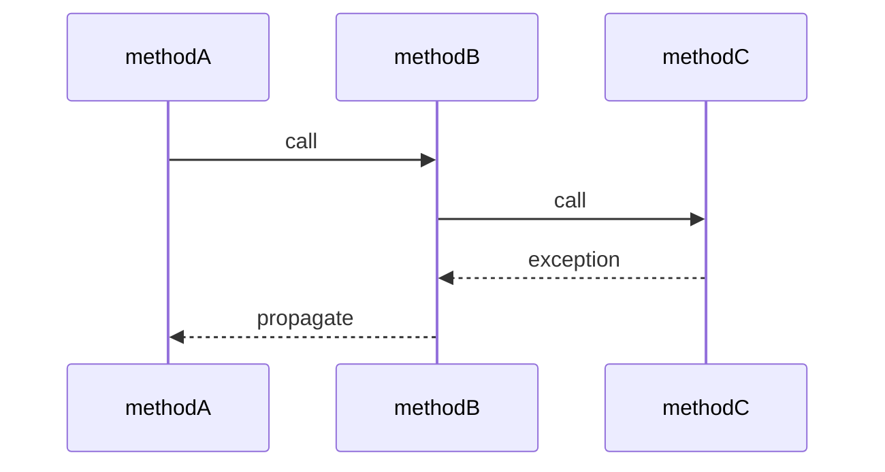

# 🔥 Exception Propagation — INTERVIEW NOTES (IN-DEPTH)

---

## ✅ Definition

* Exception propagation is the process where an exception thrown in one method automatically moves up the call stack until a matching handler is found.
* If the current method does not handle it, JVM passes it to the caller method.

### 📌 Simple 1-Line Explanation

* If a method does not catch an exception, Java automatically passes it to the caller.

> 👉 **Interview Tip:**
> Use the phrase “stack unwinding” — interviewers love this.
> “Propagation happens through stack unwinding until a matching catch block is found.”

---

## 🧠 Why It Is Important

* Defines where failures should be handled
* Helps build clean layered architecture
* Avoids unnecessary try-catch in every method
* Essential for:

  * service layer design
  * Spring global exception handling
  * transaction rollback
  * logging boundaries
* Very important in banking systems

### 🏦 Banking Domain Relevance

In fund transfer:

* dao() → DB timeout

* service() → rollback transaction

* controller() → return API error

* global handler → convert to HTTP response

* This is real layered propagation design.

> 🔥 **Important:**
> Good engineers know where to stop propagation.

---

## 🔹 Core Concepts



### 1) What Is Exception Propagation?

* Exception occurs in method
* current method does not handle it
* JVM passes it to caller
* caller may:

  * handle it
  * rethrow it
  * propagate further

#### Internal JVM Flow

* exception object created
* current stack frame checked
* no handler found
* frame popped
* caller checked
* repeat until handled
* This is called stack unwinding.

### 2) How Exceptions Propagate In Call Stack?

#### Example Flow

```text
main() → service() → dao()
```

If dao() throws:

```java
throw new SQLException("DB timeout");
```

Flow becomes:

* dao() checked
* no catch → move to service()
* no catch → move to main()
* no catch → JVM default handler

#### Stack Unwinding Visual

```text
dao() ← exception starts
↑
service()
↑
main()
```

### 3) What Happens If Exception Is Not Caught In Method?

* It propagates automatically to caller
* If no caller handles:

  * thread terminates
  * stack trace printed
  * API returns 500
  * transaction may rollback

#### Banking Risk

* If not handled correctly:

  * transfer may remain pending
  * duplicate retries may happen
  * inconsistent ledger possible

---

## 🔍 Interview Follow-Up Questions

### ❓ Does Exception Propagate Automatically?

#### ✅ Yes

* Both:

  * checked
  * unchecked
* propagate automatically at runtime.

#### Difference

* checked exceptions need throws declaration
* unchecked do not need declaration
* runtime propagation mechanism is same

> 👉 **Interview Tip:**
> Important line:
> “Propagation behavior is same at runtime; compiler rules differ.”

### ❓ Do Checked And Unchecked Exceptions Propagate Differently?

#### ⚡ Runtime → No

* Both propagate through call stack the same way.

#### ⚡ Compile Time → Yes

Checked exceptions:

* must be caught
* OR declared with throws

Unchecked:

* no compiler enforcement

#### Example

```java
public void dao() throws IOException
```

* For RuntimeException, this is optional.

### ❓ What Happens In Multithreaded Propagation?

> 🔥 **Very Important Senior-Level Topic**

* Exceptions propagate only within the same thread stack
* They do not jump to parent thread
* If uncaught:

  * that thread dies
  * other threads continue
  * pool thread may get replaced

#### Example

* payment reconciliation thread fails
* only that worker thread terminates
* application continues

#### Banking Example

* async statement generation thread crashes
* transfer service thread unaffected

> 👉 **Interview Tip:**
> Say:
> “Propagation is thread-bound, not application-wide.”
> This sounds very strong.

---

## 💻 Code Example

### ✅ Simple Propagation Example

```java
public class TransferApp {

    public static void main(String[] args) {
        service();
    }

    static void service() {
        dao();
    }

    static void dao() {
        int x = 10 / 0; // ArithmeticException
    }
}
```

#### Flow

* exception in dao()
* propagates to service()
* propagates to main()
* JVM terminates main thread

### ✅ Proper Handling At Service Layer

```java
public class TransferApp {

    public static void main(String[] args) {
        service();
    }

    static void service() {
        try {
            dao();
        } catch (ArithmeticException e) {
            System.out.println("Rollback transfer");
        }
    }

    static void dao() {
        int x = 10 / 0;
    }
}
```

#### Why This Is Better

* DAO remains focused on DB logic
* service handles business rollback
* proper layering

---

## 🌍 Real-World Examples

### 🏦 Example 1: Fund Transfer

```text
controller → service → dao
```

* DAO throws SQLException
* Service catches
* rollback
* mark failed
* Controller returns error response

### 💳 Example 2: Payment Gateway

* client layer timeout
* propagated to service
* service pushes to retry queue
* controller returns pending response

### 📁 Example 3: Async Report Thread

* file generation fails
* thread exception handler logs
* retry scheduler restarts job

---

## ⚠️ Common Interview Traps

### ❌ Trap 1: Catching In DAO Layer

* Bad if business recovery needed at service layer.
* DAO should focus on persistence only.

### ❌ Trap 2: Catching And Swallowing

```java
catch (Exception e) {}
```

* Very dangerous.
* Breaks propagation and hides failure.

### ❌ Trap 3: Logging At Every Layer

* Creates duplicate noisy logs.
* Best place:

  * boundary layer
  * global handler
  * async thread exception handler

### ❌ Trap 4: Thinking Parent Thread Gets Child Exception

* False in multithreading.

---

## 🚀 Best Practices

* Handle exception at right abstraction layer
* DAO:

  * throw persistence exceptions
* Service:

  * rollback + business recovery
* Controller:

  * convert to API response
* Use global exception handler in Spring
* Avoid repeated catch-rethrow without value
* Preserve root cause
* Log once at boundary

### 🏦 Banking Best Practice

Propagation path:

```text
DAO → Service → ControllerAdvice
```

* This is clean production architecture.

---

## 🎯 Scenario-Based Interview Question

### ❓ Scenario

```text
main() → service() → dao()
```

* Exception occurs in dao()
* 👉 Where should it be handled and why?

### ✅ Best Interview Answer

* Best place is usually service layer
* DAO should only interact with DB
* Service understands:

  * transaction rollback
  * retry strategy
  * business compensation
  * customer notification
* Controller/global handler converts final response

### 🏦 Banking Example

* If debit DB update fails:

  * DAO throws exception
  * Service performs rollback
  * Controller returns:

```java
"Transfer failed, please retry"
```

* 👉 This is the most production-correct layered answer.

---

## 🎯 Interview-Ready Final Answer

* Exception propagation means automatic movement of an exception from called method to caller method until a matching catch block is found.
* JVM performs this using stack unwinding, popping stack frames one by one.
* Checked and unchecked exceptions both propagate the same way at runtime, though checked exceptions require compile-time declaration.
* In layered applications, exceptions should usually be handled at the service layer, where rollback and compensation logic belongs.
* In multithreading, propagation remains limited to the same thread and does not cross thread boundaries.

> 👉 **Interview Tip (2+ Years Experience):**
> Always connect this with:
>
> * service-layer rollback
> * Spring @Transactional
> * global exception handling
> * async worker thread failure
> * retry queues / DLQ
>
> This makes your answer sound senior and enterprise-ready.
