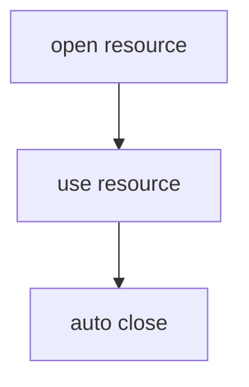

# 🔥 Try-With-Resources (Java 7+) — INTERVIEW NOTES (IN-DEPTH)

---

## ✅ Definition

* Try-with-resources is a Java 7 feature that automatically closes resources after use, even if an exception occurs.
* It removes the need for manual cleanup in finally.

### 📌 Simple 1-Line Explanation

* It automatically closes resources like files, DB connections, and sockets.

> 👉 **Interview Tip:**
> Best one-liner:
> “Try-with-resources provides deterministic automatic cleanup for AutoCloseable resources.”

---

## 🧠 Why It Is Important

* Prevents resource leaks
* Reduces boilerplate code
* Safer than manual finally
* Preserves original exceptions better
* Supports suppressed exceptions
* Essential in:

  * file handling
  * JDBC
  * Kafka consumers
  * sockets
  * HTTP clients

### 🏦 Banking Domain Relevance

* Statement PDF generation

  * auto-close file stream
* DB transaction reports

  * auto-close JDBC connection
* Payment reconciliation batch

  * close CSV reader
* ATM socket service

  * close network socket safely

> 🔥 **Important:**
> This is one of the most production-used Java exception handling features.

---

## 🔹 Core Concepts



### 1) What Is Try-With-Resources?

* Resource is created inside try(...)
* JVM auto-closes it after block
* closure happens:

  * success
  * exception
  * return
* resources close in reverse order

```java
try (FileReader reader = new FileReader("statement.txt")) {
    // read file
}
```

#### Internal Behavior

Compiler converts it roughly into:

* try
* hidden finally
* close() call
* This is safer than manual finally.

### 2) Why Was It Introduced?

Before Java 7:

* developers manually closed resources
* easy to forget cleanup
* finally blocks became huge
* original exceptions got hidden

#### Old Style

```java
FileReader reader = null;
try {
    reader = new FileReader("a.txt");
} finally {
    if (reader != null) reader.close();
}
```

#### Problems

* verbose
* null checks
* nested try-finally
* error-prone
* hard to read

> 👉 Java introduced try-with-resources for cleaner and safer cleanup.

### 3) Which Interface Must Resource Implement?

#### ✅ AutoCloseable

* Any resource used inside try-with-resources must implement:
* Java `AutoCloseable`

```java
public interface AutoCloseable {
    void close() throws Exception;
}
```

#### Common Examples

* FileReader
* BufferedReader
* Scanner
* Connection
* PreparedStatement
* Socket

> 🔥 **Important:**
> Closeable is child of AutoCloseable.

---

## 🔍 Interview Follow-Up Questions

### ❓ Difference Between finally and Try-With-Resources

| Feature               | finally   | Try-With-Resources |
| --------------------- | --------- | ------------------ |
| Cleanup               | Manual    | Automatic          |
| Boilerplate           | High      | Low                |
| Null checks           | Needed    | Not needed         |
| Exception safety      | Less safe | More safe          |
| Suppressed exceptions | Hard      | Built-in           |
| Preferred today       | ❌ Less    | ✅ Yes              |

> 👉 **Interview Tip:**
> Best line:
> “Try-with-resources is compiler-generated finally with better exception preservation.”

### ❓ What Is AutoCloseable?

* Built-in Java interface
* Marks object as cleanup resource
* JVM auto-calls close()
* Works with custom resources too

#### Custom Example

```java
class PaymentLock implements AutoCloseable {
    public void close() {
        System.out.println("Lock released");
    }
}
```

* This can be used inside try-with-resources.

### ❓ Can We Use Multiple Resources?

#### ✅ Yes

* Very common in JDBC.

```java
try (
    Connection con = dataSource.getConnection();
    PreparedStatement ps = con.prepareStatement("SELECT * FROM tx")
) {
    // execute query
}
```

#### Closing Order

Closed in reverse order:

1. PreparedStatement
2. Connection

> 🔥 **Important:**
> Reverse close order is a favorite tricky interview question.

---

## 💻 Code Example

### 🏦 Banking Statement Example

```java
import java.io.BufferedReader;
import java.io.FileReader;
import java.io.IOException;

public class StatementService {

    public void readStatement() throws IOException {
        try (BufferedReader br =
                 new BufferedReader(new FileReader("statement.txt"))) {

            System.out.println(br.readLine());
        }
    }
}
```

#### Why This Is Correct

* automatic cleanup
* no finally needed
* production-safe
* clean readable code

---

## 🌍 Real-World Examples

### 🏦 Banking

* transaction CSV reader
* PDF statement stream
* JDBC report connection
* fraud audit file parser

### 🏥 Healthcare

* patient report reader
* diagnostic image stream
* EMR file export
* CSV bulk patient import

### 💳 Payment Systems

* settlement file parser
* gateway socket client
* batch reconciliation reader

---

## ⚠️ Common Interview Traps

### ❌ Trap 1: Resource Not Implementing AutoCloseable

* Cannot be used in try-with-resources.

### ❌ Trap 2: Thinking Close Order Is Same

* Wrong.
* It is reverse order.

### ❌ Trap 3: Using finally For Streams In Modern Java

* Outdated style.

### ❌ Trap 4: Ignoring Suppressed Exceptions

* Very important advanced topic.

---

## 🚀 Best Practices

* Prefer try-with-resources for all closable resources
* Use multiple resources when related
* Keep resource scope small
* Use custom AutoCloseable for locks
* Avoid manual finally for streams/JDBC
* Log suppressed exceptions
* Use in:

  * JDBC
  * file IO
  * sockets
  * Kafka consumers
  * HTTP clients

### 🏦 Banking Production Insight

Great for:

* DB connections

* reconciliation files

* settlement CSV imports

* fraud logs

* This avoids resource pool exhaustion.

---

## 🎯 Interview-Ready Final Answer

* Try-with-resources is a Java 7 feature that automatically closes resources after use, even when exceptions occur.
* It was introduced to replace verbose manual cleanup code written in finally blocks.
* Any resource used must implement AutoCloseable, which provides the close() method.
* It is safer than finally because it reduces boilerplate and preserves suppressed exceptions.
* Multiple resources are supported and are closed automatically in reverse order.

> 👉 **Interview Tip (2+ Years Experience):**
> Always connect this topic with:
>
> * JDBC cleanup
> * connection pool leaks
> * suppressed exceptions
> * custom AutoCloseable locks
> * Kafka / file readers
> * reverse close order
>
> This makes your answer sound senior, modern Java, and production-focused.
