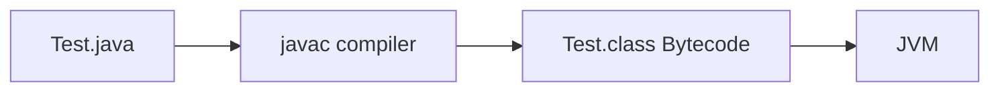
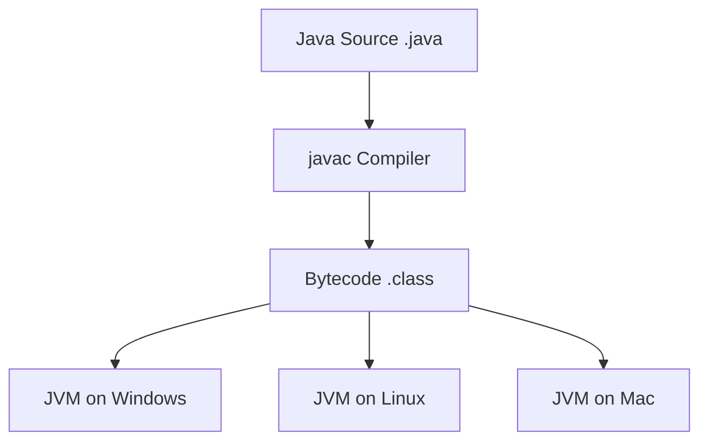
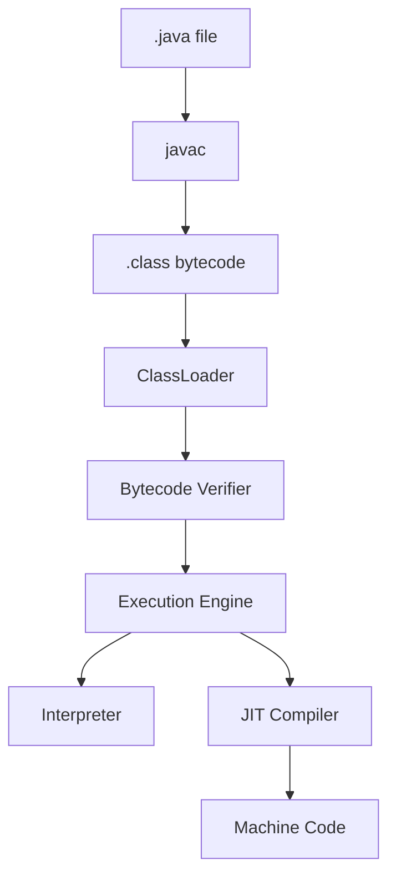
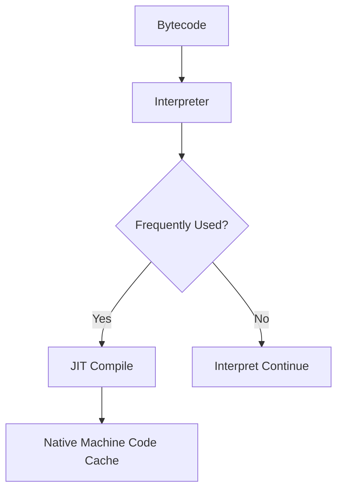
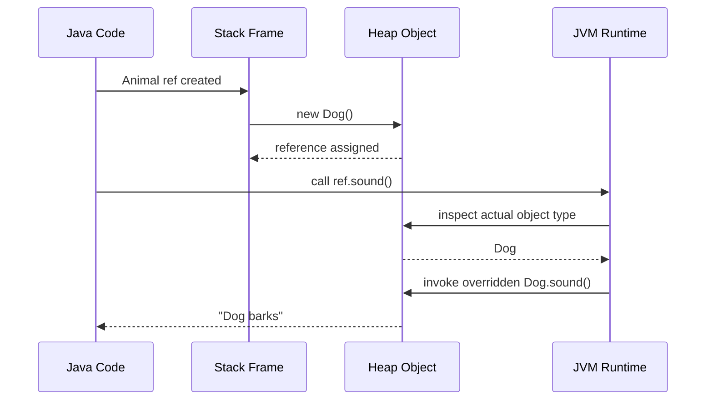
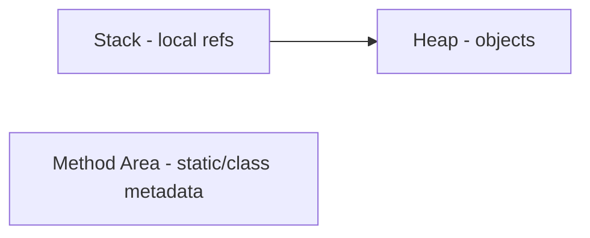
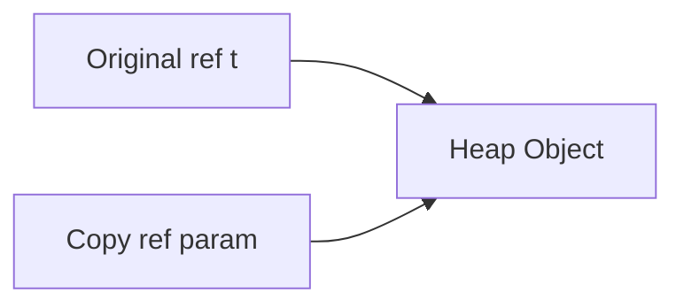

# Day 1 — Core Java Fundamentals + OOP Foundation Notes

---

# 1) Java Fundamentals

## ✅ What makes Java special

* **Simple** → removes complex C/C++ features like pointer arithmetic
* **Object-oriented** → class + object based design
* **Platform independent** → *Write Once, Run Anywhere*
* **Robust** → strong memory management, exception handling, type checking
* **Secure** → bytecode verification + JVM sandbox + classloader isolation
* **Multithreaded** → built-in thread support
* **High performance** → JIT compiler converts hot bytecode to machine code

```mermaid
flowchart LR
    A[Java Features] --> B[Portable via JVM]
    A --> C[Secure via Bytecode Verification]
    A --> D[Fast via JIT]
    A --> E[Memory Safe via GC]
 ```   
---

## ✅ JDK vs JRE vs JVM

```mermaid
flowchart TD
    A[JDK] --> B[JRE]
    B --> C[JVM]
    A --> D[javac compiler]
    B --> E[Java libraries]
    C --> F[Execution Engine]
```

    
* **JDK (Java Development Kit)**

  * Used for **development**
  * Includes:

    * JRE
    * compiler (`javac`)
    * debugger
    * javadoc
    * development tools

* **JRE (Java Runtime Environment)**

  * Used to **run Java applications**
  * Includes:

    * JVM
    * core libraries
    * supporting files

* **JVM (Java Virtual Machine)**

  * Executes **bytecode**
  * Converts bytecode into machine-level instructions
  * Responsible for:

    * memory allocation
    * garbage collection
    * class loading
    * runtime execution

### 📝 Remember

* **JDK = develop + run**
* **JRE = run only**
* **JVM = actual execution engine**

---

# 2) ⚙️ JDK vs JRE vs JVM

| Feature            | JDK                     | JRE                      | JVM                  |
| ------------------ | ----------------------- | ------------------------ | -------------------- |
| Full Form          | Java Development Kit    | Java Runtime Environment | Java Virtual Machine |
| Purpose            | Develop + Run Java apps | Run Java apps            | Executes bytecode    |
| Contains compiler  | ✅ Yes                   | ❌ No                     | ❌ No                 |
| Contains JVM       | ✅ Yes                   | ✅ Yes                    | ✅ Core               |
| Contains libraries | ✅ Yes                   | ✅ Yes                    | Uses runtime libs    |
| Used by            | Developers              | End users                | Java runtime         |


Bytecode is the **intermediate machine-independent code** generated after compilation.



# 2) Why Java is Platform Independent

* Java source code compiles into **bytecode (`.class`)**
* Bytecode runs on **JVM**
* Every OS has its own JVM implementation
* Same `.class` file works on Windows/Linux/Mac

## Mermaid Flow



### 🎯 Interview line

> Java is platform independent because compiler generates **platform-neutral bytecode**, and JVM converts it into OS-specific machine code.

---

# 3) How Java Code Executes Internally

## Execution Pipeline



## ✅ Step-by-step

* Write source code in `.java`
* `javac` compiles it into `.class`
* **ClassLoader** loads class into JVM memory
* **Bytecode verifier** checks safety rules
* **Execution engine** runs bytecode
* Frequently used code is optimized by **JIT**

## 📝 Points to remember

* **Interpreter** → line by line execution
* **JIT** → frequently executed code optimization
* JIT improves runtime speed significantly

---

## ⚡ JIT Basics

JIT = **Just In Time Compiler**



## ✅ Heap vs Stack

| Feature    | Heap    | Stack           |
| ---------- | ------- | --------------- |
| Stores     | Objects | Local variables |
| Shared     | Yes     | No              |
| Managed by | GC      | Automatic       |
| Speed      | Slower  | Faster          |


# 4) Class and Object

## ✅ Class

> A class in Java is a blueprint or template used to create objects.
>It defines:
>* state (variables / data members) → what an object has
>* behavior (methods) → what an object does

* A class itself is only a logical definition.

Example:
```java
class Student {
    String name;
    void study() {
        System.out.println("Studying");
    }
}
```
✅ Real-Life Analogy

Think of a class as a blueprint of a house.

Blueprint = class
Real house = object

From one blueprint, we can create multiple houses.

✅ Why We Use Classes

We use classes to:
* achieve encapsulation
* represent real-world entities
---

## ✅ Object

>* An object in Java is an instance of a class.
>* A class acts as a blueprint, and an object is the actual entity created from that blueprint at runtime.

When we write:
```java
Student s = new Student();
```
* s1 reference variable is created in stack memory
* object is created in heap memory
* instance variables belong to object memory
---

# ✅ Difference Between Class and Object

| Point | Class | Object |
|---|---|---|
| Definition | A class is a blueprint or template that defines variables and methods. | An object is a runtime instance of a class that holds actual values. |
| Nature | It is a logical entity and does not represent a real memory instance by itself. | It is a real entity created at runtime and occupies memory. |
| Memory | Memory for instance variables is not allocated when the class is declared. | Memory is allocated in the heap when the object is created. |
| Example | `class Student {}` | `Student s1 = new Student();` |

---

# ✅ Data Members and Methods

>In Java, a class is mainly made up of data members and methods.

>* Data members define the state or properties of an object.
>* Methods define the behavior or actions that the object can perform.

Example:
```java
class Car {
    String brand;   // data member
    String color;   // data member
    int speed;      // data member

    void start() {  // method
        System.out.println("Car started");
    }

    void stop() {   // method
        System.out.println("Car stopped");
    }
}
```
✅ Explanation

In the above example:

>Data Members : These store the car’s properties:
* brand
* color
* speed

>Methods : These define what the car can do:
* start()
* stop()
These represent the behavior of the car.

---

## In Java, there are four standard ways to create objects.

# ✅ 1) Using the new Keyword (Most Common)

>This is the most frequently used way.

When we use new, Java:

allocates memory in the heap
calls the constructor
returns the object reference
Example
```java
class Student {
    String name;
}

public class Main {
    public static void main(String[] args) {
        Student s1 = new Student();
    }
}
```

# ✅ 2) Using newInstance() Method

> We can create objects using reflection.
> This method creates the object dynamically at runtime.

Example
```java
class Student {
}

public class Main {
    public static void main(String[] args) throws Exception {
        Student s1 = Student.class.getDeclaredConstructor().newInstance();
    }
}
```
> Used when the class name is known only at runtime.

Very common in:

* Spring Framework
* Hibernate
* JDBC drivers
* Reflection APIs

# ✅ 3) Using clone() Method

> We can create a new object by copying an existing object.
> This is called object cloning.

Example
```java
class Student implements Cloneable {
    String name = "Rahul";

    public Object clone() throws CloneNotSupportedException {
        return super.clone();
    }
}

public class Main {
    public static void main(String[] args) throws Exception {
        Student s1 = new Student();
        Student s2 = (Student) s1.clone();
    }
}
```
> This creates a duplicate object.

# ✅ 4) Using Deserialization

> When an object is read from a file or network stream, Java creates it automatically.
> This is called deserialization.

Example
```java
ObjectInputStream in = new ObjectInputStream(new FileInputStream("data.txt"));
Student s1 = (Student) in.readObject();
```
Common in:
* caching
* distributed systems
* microservices
* file storage

---

# what is object oriented programming

> Object-Oriented Programming (OOP) is a way of designing programs using classes and objects to represent real-world entities, making the code easier to understand, reuse, and maintain.
---

## OOP Pillars


## A) Encapsulation

> Encapsulation is one of the core OOP principles in Java.

> Encapsulation is the process wrapping data (variables) and methods into a single unit called class, and restricting direct access to the data.
> This is achieved by:
> * declaring variables as private
> * providing access through public getter and setter methods

# ✅ Real-Life Example

Think of a bank account.

You cannot directly change the account balance from outside.
You must use methods like:

deposit()
withdraw()
getBalance()

This is encapsulation + data hiding.

```java
class Account {
    private double balance;

    public void setBalance(double balance) {
        this.balance = balance;
    }

    public double getBalance() {
        return balance;
    }
}
```

# ✅ Benefits of Encapsulation in Java

> * **Data Hiding** - Protects data from direct unauthorized access by making variables private.
> * **Better Security** - Allows controlled access to data through getter and setter methods.
> * **Improved Maintainability** - Internal implementation can be changed without affecting external code.
> * **Better Flexibility and Reusability** - Makes the code modular, reusable, and easier to manage in large applications.

---

## B) Abstraction

* Hides implementation details
* Shows only essential behavior
* Achieved using:

  * abstract class
  * interface

```java
abstract class Vehicle {
    abstract void start();
}
```

---

## C) Inheritance

* Child acquires parent properties
* Promotes code reuse

```java
class Animal {
    void sound() {}
}

class Dog extends Animal {}
```

### 📝 Remember

* Java supports:

  * single
  * multilevel
  * hierarchical
* No multiple inheritance with classes

---

# D) Polymorphism

## Method Overloading vs Overriding

## ✅ Overloading

* same method name
* different parameters
* compile-time resolution

```java
class Calc {
    int add(int a, int b) { return a + b; }
    double add(double a, double b) { return a + b; }
}
```

## ✅ Overriding

* child changes parent behavior
* same signature
* runtime resolution

```java
class Parent {
    void show() { System.out.println("Parent"); }
}

class Child extends Parent {
    @Override
    void show() { System.out.println("Child"); }
}
```
## 📌 Key differences

| Topic              | Overloading  | Overriding |
| ------------------ | ------------ | ---------- |
| polymorphism       | compile-time | runtime    |
| inheritance needed | no           | yes        |
| parameters         | must differ  | same       |

## 📝 Tricky notes

* static methods are **hidden**, not overridden
* private methods are not overridden
* return type alone cannot overload

---

### 🎯 Remember

* **reference type decides access**
* **object type decides overridden method execution**

---

# 🧠 Dynamic Method Dispatch

> **Definition:** Method call resolution based on the **actual object type at runtime**, not the reference type.

---

## ✅ Java Example Context

```java
class Animal {
    void sound() {
        System.out.println("Animal sound");
    }
}

class Dog extends Animal {
    @Override
    void sound() {
        System.out.println("Dog barks");
    }
}

public class Test {
    public static void main(String[] args) {
        Animal a = new Dog();
        a.sound();   // Dynamic method dispatch
    }
}
```

**Output**

```text
Dog barks
```
---

## 🔥 Internal JVM Dispatch Diagram



---

## 🎯 Interview Explanation (1-line Answer)

> **Compiler checks reference type, but JVM chooses overridden method using actual object type at runtime.**

---

## ⚠️ Common Interview Trap

**If reference is parent, why child method executes?**

✅ **Best answer:**
Because **overridden methods use runtime object type resolution via dynamic dispatch**.

---

## 🚀 Quick Revision Bullets

* Overriding = runtime polymorphism
* Parent reference can hold child object
* JVM checks actual object at runtime
* Method resolution happens dynamically
* Very common Spring Boot proxy interview topic


# 6) `this` vs `super`

## ✅ `this`

* refers to **current object**
* used for:

  * current object variable
  * current method
  * constructor chaining

```java
class User {
    String name;

    User(String name) {
        this.name = name;
    }
}
```

---

## ✅ `super`

* refers to **parent class object**
* used for:

  * parent variable
  * parent method
  * parent constructor

```java
class Parent {
    Parent() {}
}

class Child extends Parent {
    Child() {
        super();
    }
}
```

## 📌 Difference Table

| Topic                 | this           | super         |
| --------------------- | -------------- | ------------- |
| Refers to             | current object | parent object |
| Constructor chaining  | yes            | yes           |
| Access parent members | no             | yes           |

## 📝 Must remember

* `this()` and `super()` must be **first statement in constructor**
* cannot use both together as first line

---

# 7) Constructor vs Method

| Feature     | Constructor        | Method          |
| ----------- | ------------------ | --------------- |
| Purpose     | initialize object  | define behavior |
| Return type | none               | required/void   |
| Name        | same as class      | any valid name  |
| Invocation  | automatic on `new` | explicit call   |

## ✅ Constructor example

```java
class Employee {
    Employee() {
        System.out.println("Created");
    }
}
```

## 📝 Important points

* can be overloaded
* cannot be overridden
* can be private
* abstract class can have constructor
* interface cannot

---

# 9) Variables + Memory Basics

## ✅ Types of variables

### Local variable

* declared inside method
* stored in stack
* no default value

### Instance variable

* belongs to object
* stored in heap with object
* gets default values

### Static variable

* belongs to class
* shared among all objects
* stored in method area/metaspace

```java
class Company {
    static String org = "ABC";
    String employeeName;
}
```

## Memory Diagram



## 📝 Remember

* object → heap
* local variable → stack
* static → class level shared memory

---

# 10) Java Pass By Value

## ✅ Golden rule

> Java is **always pass by value**.

For objects, Java passes **copy of reference**, not original reference variable.

```java
class Test {
    int value = 10;
}

class Main {
    static void update(Test t) {
        t.value = 20;
    }
}
```

## ✅ Why value changes then?

* copy of reference points to same heap object
* object changes are visible
* reference reassignment is not reflected outside

## Mermaid Visualization



## 📝 Important trap point

* Java **cannot swap original references** through method calls
* because copies are swapped, not caller refs

---

# 11) Most Important Day 1 Trap Concepts

## ✅ Must remember bullets

* Java is **not purely object-oriented** because of primitives
* constructor is **not inherited**
* constructor can be **overloaded**
* static methods are **resolved by reference type**
* overridden methods resolved by **actual object type**
* `this` unavailable in static context
* `super()` inserted automatically if omitted
* parent constructor runs before child
* local variables need initialization
* instance variables get default values
* OOP = Encapsulation + Abstraction + Inheritance + Polymorphism
