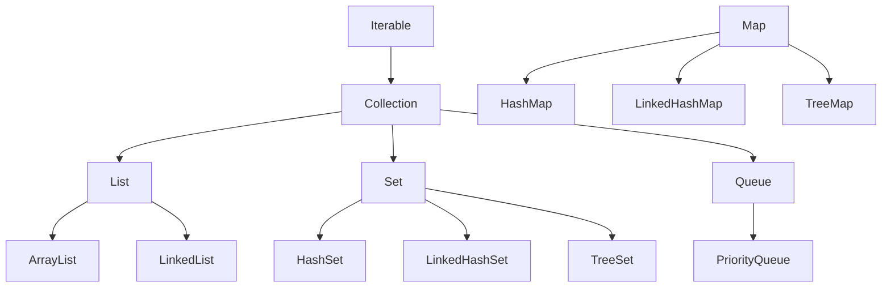
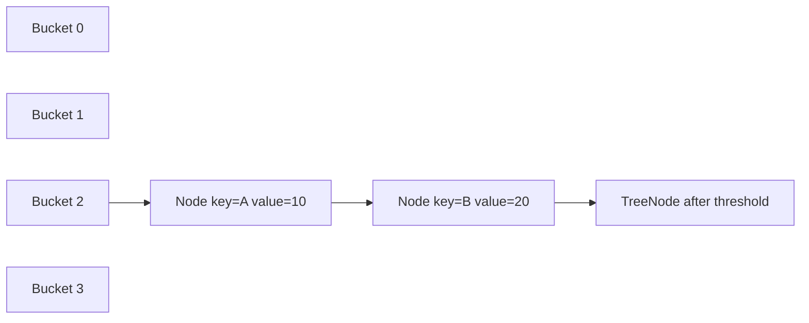
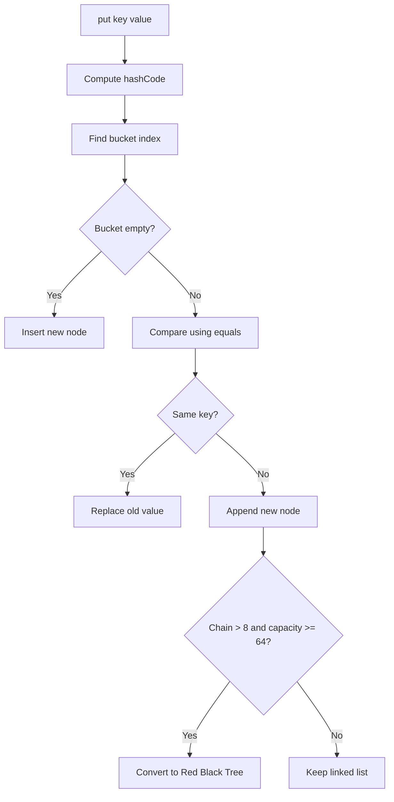
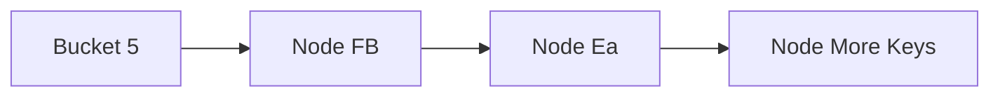
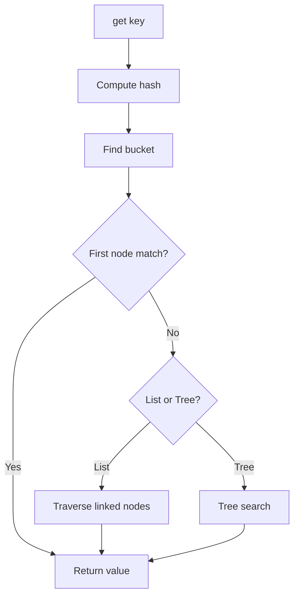
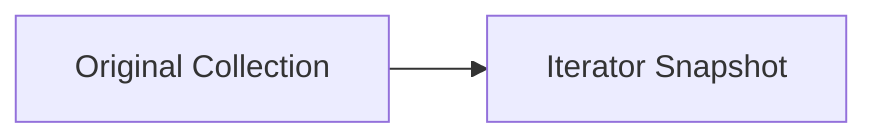

# Day 3 — Collections Framework, `HashMap` Internals, Comparable vs Comparator Notes


# 1) Collections Framework Overview

## ✅ What is Collections Framework

* A unified architecture to **store, manipulate, and retrieve groups of objects**
* Provides:

  * interfaces
  * implementations
  * utility algorithms
* Reduces custom data structure code
* Generic and reusable

## ✅ Core interfaces

* `List`
* `Set`
* `Queue`
* `Map` *(separate hierarchy)*

## Mermaid Hierarchy



## 📝 Points to remember

* `Map` does **not extend Collection**
* choose DS based on:

  * ordering
  * duplicates
  * lookup speed
  * sorting needs

---

# 2) List Implementations

## ✅ `ArrayList`

* dynamic array
* maintains insertion order
* allows duplicates
* fast random access: **O(1)**
* slow middle insertion/deletion: **O(n)**

```java
List<String> list = new ArrayList<>();
list.add("A");
```

## ✅ `LinkedList`

* doubly linked list
* fast insertion/deletion in middle: **O(1)** (after node reach)
* slower random access: **O(n)**
* also implements `Deque`

## 🎯 Interview trap

* frequent reads → `ArrayList`
* frequent inserts/deletes → `LinkedList`

---

# 3) Set Implementations

## ✅ `HashSet`

* no duplicates
* unordered
* backed by `HashMap`
* average add/search: **O(1)**

```java
Set<Integer> set = new HashSet<>();
```

## ✅ `LinkedHashSet`

* insertion order maintained
* uses linked structure

## ✅ `TreeSet`

* sorted ascending by default
* Red-Black Tree based
* operations: **O(log n)**

## 📝 Remember

* duplicate detection uses:

  * `hashCode()`
  * `equals()`

---

# 4) Queue Implementations

## ✅ `PriorityQueue`

* elements ordered by priority
* natural ordering / comparator
* min-heap internally
* insertion/removal: **O(log n)**

```java
Queue<Integer> pq = new PriorityQueue<>();
```

## ✅ `ArrayDeque`

* faster than `Stack`
* supports add/remove from both ends

---

# 5) Map Implementations

## ✅ `HashMap`

* key-value pairs
* one null key, multiple null values
* unordered
* average operations: **O(1)**

## ✅ `LinkedHashMap`

* insertion/access order maintained
* useful for LRU cache

## ✅ `TreeMap`

* sorted by key
* Red-Black Tree
* operations: **O(log n)**

## ✅ `Hashtable`

* synchronized
* legacy
* no null key/value

---

# ⭐ `HashMap` Internal Working (Java 8+)


# 1) Core Internal Idea

`HashMap` stores data in **key-value pairs**.

Internally it uses:

* **array of buckets**
* each bucket stores:

  * single node
  * linked list of nodes
  * Red-Black Tree (Java 8+)

## ✅ Internal structure

```java
Node<K,V>[] table;
```

Each bucket contains nodes like:

```java
static class Node<K,V> {
    final int hash;
    final K key;
    V value;
    Node<K,V> next;
}
```

## 📝 Points to remember

* default capacity = **16**
* default load factor = **0.75**
* average lookup = **O(1)**
* Java 8 improves heavy collisions with treeification

---

# 2) Mermaid Diagram — Internal Bucket Structure



## 🎯 Understanding

* bucket array is primary storage
* same bucket may contain multiple nodes
* collisions chain nodes together
* large chains convert into tree nodes

---

# 3) `put(key, value)` Internal Working

## ✅ Step-by-step flow

1. compute `hashCode()` of key
2. spread hash for better distribution
3. calculate bucket index
4. if bucket empty → insert node
5. if collision occurs:

   * compare key using `equals()`
   * same key → replace value
   * different key → add new node
6. if chain length > **8** and capacity >= **64**

   * convert linked list → **Red-Black Tree**

---

# 4) Mermaid Diagram — `put()` Flow



## 📝 Important trap point

> `HashMap` uses **`hashCode()` for bucket selection** and **`equals()` for exact key match**.

---

# 5) Bucket Index Calculation

## ✅ Formula

```java
index = (n - 1) & hash;
```

Where:

* `n` = current array size
* default = `16`

## ✅ Why this formula

* faster than modulo `%`
* works best when capacity is power of 2

## 📝 Must remember

Java keeps capacity in **power of 2** for optimized bit masking.

---

# 6) Collision Handling

## ✅ What is collision

When multiple keys land in the **same bucket index**.

## Example

```java
map.put("FB", 1);
map.put("Ea", 2);
```

These are famous collision examples.

## ✅ Collision resolution

* Java 7 → linked list only
* Java 8 → linked list → tree after threshold

## Mermaid Diagram



---

# 7) Treeification (Java 8+)

## ✅ When treeification happens

* bucket chain length > **8**
* capacity >= **64**

## ✅ Thresholds

* treeify threshold = **8**
* untreeify threshold = **6**
* min treeify capacity = **64**

## 🎯 Why introduced

Before Java 8:

* worst case = **O(n)**

After Java 8:

* worst case = **O(log n)**

## 📝 Interview note

This is a **very high-frequency interview question**.

---

# 8) `get(key)` Internal Working

## ✅ Flow

1. compute hash
2. locate bucket
3. compare first node
4. if list → traverse
5. if tree → tree search
6. return matched value

---

# 9) Mermaid Diagram — `get()` Flow



---

# 10) Time Complexity

| Operation  | Average |    Worst |
| ---------- | ------: | -------: |
| `put()`    |    O(1) | O(log n) |
| `get()`    |    O(1) | O(log n) |
| `remove()` |    O(1) | O(log n) |

## 📝 Why average is O(1)

Because good hash distribution spreads keys across buckets evenly.

---

# 11) Most Important Interview Answer

> `HashMap` internally uses an array of buckets. It computes `hashCode()` to find the bucket and uses `equals()` to locate the exact key. In Java 8+, long collision chains are converted into a Red-Black Tree after 8 nodes to improve worst-case performance.

---

# 12) Must Remember Trap Points

## ✅ Important bullets

* one null key allowed
* multiple null values allowed
* not thread-safe
* insertion order not guaranteed
* `equals()` + `hashCode()` both required
* treeify threshold = **8**
* resize threshold = **capacity × 0.75**
* capacity grows in powers of 2

---

## ✅ Java 8 optimization

* if bucket nodes > **8** → linked list becomes **Red-Black Tree**
* improves worst-case from **O(n)** to **O(log n)**
---

# 7) Collision Handling

## ✅ What is collision

When multiple keys map to same bucket.

## Example

```java
map.put("FB", 1);
map.put("Ea", 2);
```

These famously produce same hash in many Java versions.

## ✅ Handling

* Java 7 → linked list
* Java 8 → linked list → tree after threshold

## 📝 Remember thresholds

* treeify threshold = **8**
* untreeify threshold = **6**
* min capacity for treeify = **64**

---

# 8) `equals()` + `hashCode()` in Collections

## ✅ Why mandatory

For custom objects in:

* `HashMap`
* `HashSet`
* `LinkedHashSet`

```java
class User {
    int id;

    @Override
    public boolean equals(Object o) {
        return this.id == ((User) o).id;
    }

    @Override
    public int hashCode() {
        return Integer.hashCode(id);
    }
}
```

## 🎯 Interview trap

* same `equals`
* different `hashCode`
* duplicate objects may enter `HashSet`

---

# 9) Fail-Fast vs Fail-Safe

## ✅ Fail-Fast

* throws `ConcurrentModificationException`
* if collection modified during iteration
* examples:

  * `ArrayList`
  * `HashMap`

```java
for (String s : list) {
    list.add("x");
}
```

## ✅ Fail-Safe

* iterates over cloned snapshot
* no exception
* examples:

  * `CopyOnWriteArrayList`
  * `ConcurrentHashMap`

## Mermaid Concept



## 📝 Must remember

* fail-fast = best effort detection
* uses `modCount`

---

# 10) Comparable vs Comparator ⭐

## ✅ `Comparable`

* natural ordering
* class itself defines sort logic
* method: `compareTo()`

```java
class Employee implements Comparable<Employee> {
    int id;
    public int compareTo(Employee e) {
        return this.id - e.id;
    }
}
```

## ✅ `Comparator`

* external sorting logic
* multiple sort strategies possible

```java
Comparator<Employee> byName = (a, b) -> a.name.compareTo(b.name);
```

## 📌 Difference Table

| Topic            | Comparable    | Comparator  |
| ---------------- | ------------- | ----------- |
| package          | `java.lang`   | `java.util` |
| method           | `compareTo()` | `compare()` |
| logic location   | inside class  | external    |
| multiple sorting | no            | yes         |

## 🎯 Interview usage

* one default sort → `Comparable`
* many custom sorts → `Comparator`

---

# 11) `ConcurrentHashMap` Basics

## ✅ Why needed

`HashMap` is not thread-safe.

## ✅ Benefits

* thread-safe
* better performance than `Hashtable`
* segment/bucket level locking (historically)
* modern CAS + synchronized bins

## 📝 Important

* no `ConcurrentModificationException` during concurrent iteration

---

# 12) Common Collections Coding Problems

## ✅ Must practice

* frequency map
* remove duplicates
* sort custom objects
* top K frequent elements
* first non-repeating char
* group anagrams
* LRU cache using `LinkedHashMap`
* merge intervals using list sort
* map values by frequency

---

# 13) Most Important Trap Concepts

## ✅ Must remember bullets

* `HashSet` internally uses `HashMap`
* `TreeSet` uses Red-Black Tree
* `HashMap` allows one null key
* collision uses chaining/treeification
* treeify threshold = 8
* `modCount` used in fail-fast
* `Map` separate hierarchy
* `Comparator` supports multiple sorts
* `PriorityQueue` uses heap
* `LinkedHashMap` useful for LRU

---

# 14) Day 3 Revision Cheatsheet

## ⚡ Fast recall bullets

* `ArrayList` = fast read
* `LinkedList` = fast insert/delete
* `HashSet` = unique unordered
* `TreeSet` = sorted
* `HashMap` = O(1) avg
* hash → bucket → equals
* collision → list/tree
* fail-fast → modCount
* `Comparable` = default sort
* `Comparator` = custom sort

---

# 15) Interview Answer Framework

For each collections answer use:

1. data structure type
2. ordering + duplicates
3. time complexity
4. internal DS used
5. best use case
6. trap edge case
